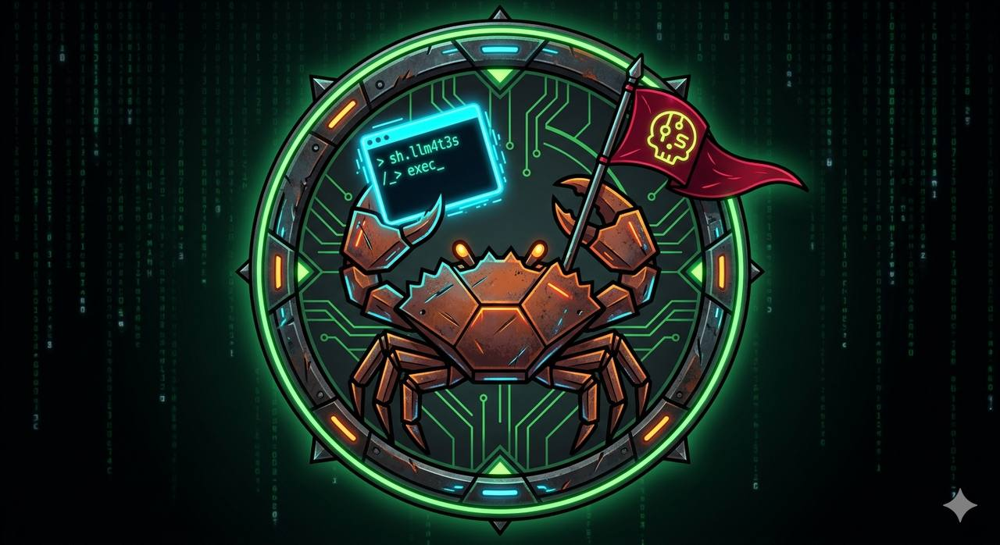

<div align="center">



<br>

**Rust developer. Offensive security. Linux internals.**

[](https://app.hackthebox.com/users/50343)
[](https://app.hackthebox.com/teams/8499)

</div>

---

### About

I build offensive security tools in Rust and spend my free time on CTF challenges, breaking into things (legally), and studying how systems actually work under the hood. Everything I write is async, minimal, and designed to run where it shouldn't.

---

### Projects

<table>
<tr>
<td width="50%" valign="top">

<p align="center"><strong>🦀 clawsh</strong><br>C2 Framework</p>

<p align="center">


</p>

Full C2 handler — multi-session REPL, auto PTY upgrade, TLS, HTTP tunneling, SOCKS5 pivoting, AI-assisted mentoring. Single ~6 MB binary, zero runtime dependencies.

**31+ post-exploitation modules** across Linux and Windows. Rhai scripting engine for custom automation.

<p align="center"><code>reverse shells</code> · <code>agent protocol</code> · <code>file transfer</code> · <code>persistence</code> · <code>port forwarding</code> · <code>credential vault</code></p>

</td>
<td width="50%" valign="top">

<p align="center"><strong>🦀 clawsh-imp</strong><br>Cross-Platform Implant</p>

<p align="center">


</p>

Lightweight implant (~1.7 MB) with encrypted C2 over TCP/TLS/HTTP. All recon via raw syscalls (Linux) and NT API (Windows) — no child processes, no `LD_PRELOAD` visibility.

**Self-deleting, polymorphic builds**, EDR-aware timing, process disguise.

<p align="center"><code>9 recon modules</code> · <code>PTY/ConPTY shell</code> · <code>memfd exec</code> · <code>8 persist methods</code> · <code>SOCKS5 relay</code> · <code>anti-debug</code></p>

</td>
</tr>
</table>

<table>
<tr>
<td width="50%" valign="top">

<p align="center"><strong>🔐 clawsh-proto</strong><br>Protocol & Crypto Layer</p>

<p align="center">


</p>

<p align="center">Shared wire protocol and cryptography for the clawsh ecosystem.</p>

<p align="center"><code>X25519 ECDH</code> · <code>ChaCha20-Poly1305</code> · <code>HKDF-SHA256</code> · <code>HMAC-SHA256 auth</code> · <code>256B traffic padding</code></p>

</td>
<td width="50%" valign="top">

<p align="center"><strong>🛡️ sentinel</strong><br>C2 Traffic Detection</p>

<p align="center">


</p>

The defensive counterpart — catches the traffic clawsh and other C2 frameworks generate.

<p align="center"><code>beacon analysis</code> · <code>JA4 fingerprinting</code> · <code>DNS anomalies</code> · <code>Sigma rules</code> · <code>statistical detection</code></p>

</td>
</tr>
</table>

---

### Crypto Stack

```
┌─────────────────────────────────────────────────────┐
│  Transport    TLS 1.3 (rustls)           optional   │
│  Key Exchange X25519 ECDH                ephemeral  │
│  Key Derive   HKDF-SHA256               per-session │
│  Encryption   ChaCha20-Poly1305          every msg  │
│  Auth         HMAC-SHA256 (PSK)          handshake  │
│  Padding      256 byte minimum           all frames │
└─────────────────────────────────────────────────────┘
```

---

### Tech

<p align="center">


</p>

---

<div align="center">
<sub>I build the tools that break things — and the tools that catch them.</sub>
</div>
