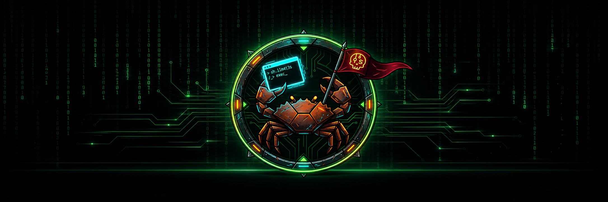

  

 

---

### About

I build offensive security tools in Rust and spend my free time on CTF challenges, breaking into things (legally), and studying how systems actually work under the hood. Everything I write is async, minimal, and designed to run where it shouldn't.

---

### Projects

<table>
<tr>
<td width="50%" valign="top">

<strong>🦀 clawsh</strong> C2 Framework

Full C2 handler — multi-session REPL, auto PTY upgrade, TLS, HTTP tunneling, SOCKS5 pivoting, AI-assisted mentoring. Single ~6 MB binary, zero runtime dependencies.

**31+ post-exploitation modules** across Linux and Windows. Rhai scripting engine for custom automation.

<code>reverse shells</code> · <code>agent protocol</code> · <code>file transfer</code> · <code>persistence</code> · <code>port forwarding</code> · <code>credential vault</code>

</td>
<td width="50%" valign="top">

<strong>🦀 clawsh-imp</strong> Cross-Platform Implant

Lightweight implant (~1.7 MB) with encrypted C2 over TCP/TLS/HTTP. All recon via raw syscalls (Linux) and NT API (Windows) — no child processes, no `LD_PRELOAD` visibility.

**Self-deleting, polymorphic builds**, EDR-aware timing, process disguise.

<code>9 recon modules</code> · <code>PTY/ConPTY shell</code> · <code>memfd exec</code> · <code>8 persist methods</code> · <code>SOCKS5 relay</code> · <code>anti-debug</code>

</td>
</tr>
</table>

<table>
<tr>
<td width="50%" valign="top">

<strong>🔐 clawsh-proto</strong> Protocol & Crypto Layer

Shared wire protocol and cryptography for the clawsh ecosystem.

<code>X25519 ECDH</code> · <code>ChaCha20-Poly1305</code> · <code>HKDF-SHA256</code> · <code>HMAC-SHA256 auth</code> · <code>256B traffic padding</code>

</td>
<td width="50%" valign="top">

<strong>🛡️ sentinel</strong> C2 Traffic Detection

The defensive counterpart — catches the traffic clawsh and other C2 frameworks generate.

<code>beacon analysis</code> · <code>JA4 fingerprinting</code> · <code>DNS anomalies</code> · <code>Sigma rules</code> · <code>statistical detection</code>

</td>
</tr>
</table>

---

### Tech

---

### Stats

<picture>
  <source media="(prefers-color-scheme: dark)" srcset="https://raw.githubusercontent.com/y0uall/y0uall/output/github-contribution-grid-snake-dark.svg">
  <source media="(prefers-color-scheme: light)" srcset="https://raw.githubusercontent.com/y0uall/y0uall/output/github-contribution-grid-snake.svg">
  
</picture>

---

I build the tools that break things — and the tools that catch them.
  

